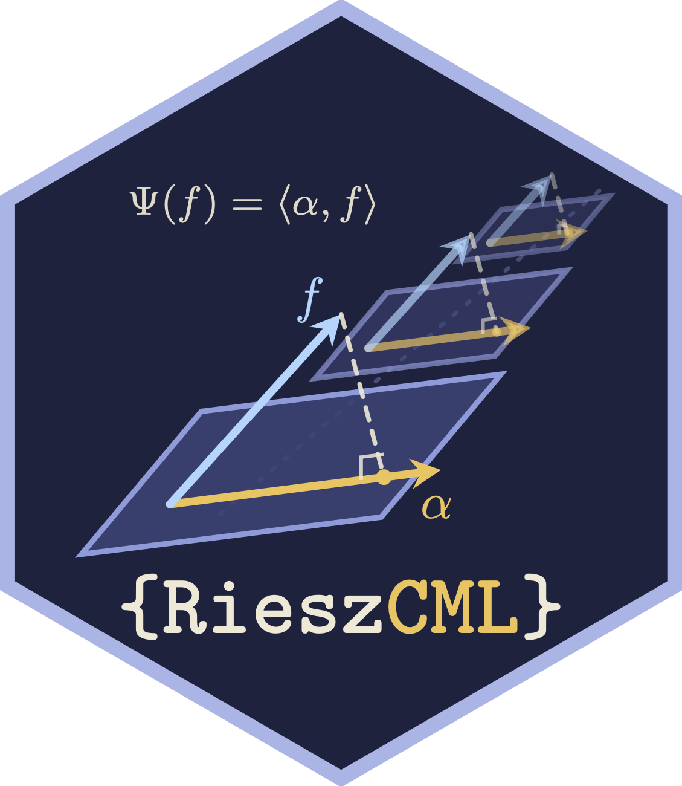

---
output:
  github_document
bibliography: "inst/REFERENCES.bib"
---

<!-- README.md is generated from README.Rmd. Please edit that file -->

```{r, echo = FALSE}
knitr::opts_chunk$set(
  collapse = TRUE,
  comment = "#>",
  fig.path = "man/figures/README-"
)
```

# `{RieszCML}` 

<!-- badges: start -->
<!-- [](https://github.com/nshlab/RieszCML/actions) --> 
[](https://www.repostatus.org/#wip)
[](https://opensource.org/licenses/MIT)
<!-- badges: end -->

> Riesz Representers for Causal Machine Learning

Software written by [Christian Testa](https://ctesta.com), 
[Salvador V. Balkus](https://salbalkus.github.io), and 
[Nima S. Hejazi](https://nimahejazi.org). 

---

## What's `RieszCML`?

The `RieszCML` R package provides a unified framework for constructing
asymptotically efficient, doubly-robust estimators — both one-step and
targeted maximum likelihood-based estimators (TMLE) — of statistical functionals
whose efficient influence function (EIF) can be expressed in terms of a
*Riesz representer* [@balkus2026riesz; @chernozhukov2022automatic; @hirshberg2021augmented].
This class of functionals encompasses a wide range of estimands from causal
inference and missing data problems, including counterfactual means, average
treatment effects, effects of modified treatment policies, subgroup effects,
direct and indirect effects from causal mediation analysis, and the effects
of time-varying treatments in longitudinal settings subject to
treatment-confounder feedback.

Rather than requiring a bespoke derivation and implementation of the EIF for
each new estimand, `RieszCML` asks the user to specify only a few modular
ingredients of the target parameter:

- a set of **nuisance function** estimates (e.g., outcome regressions,
  propensity scores), fit by any means the user prefers;
- a formula for the **Riesz representer** `alpha` (e.g., an inverse
  probability weight or density ratio);
- formulas `f` and `h` defining the regression being "residualized" and the
  plug-in transformation appearing in the parameter mapping; and
- an expression for the (uncentered) **influence curve**, typically of the
  form `~ h + alpha * (Y - f)`.

These ingredients are collected in a `RieszCurve` object, from which
estimators and Wald-style inference follow automatically via
`riesz_estimate()` (one-step) or `riesz_tmle()` (TMLE, with identity or
logistic fluctuations). Nested and sequential estimands — for example,
the iterated conditional expectations arising in longitudinal causal
inference [@vanderlaan2012tmle; @diaz2021lmtp] or corrections for two-phase
sampling designs [@rose2011twostage] — are handled compositionally by
chaining `RieszCurve` objects together with `ComposedRieszCurve`, whose EIF
involves a product of the stage-specific Riesz representers. Smooth
transformations of one or more estimands (differences, risk ratios, odds
ratios, and arbitrary user-specified contrasts) are supported through the
delta method via `riesz_delta()` and friends.

A catalog of pre-specified estimands is provided in `riesz_curve_catalog`,
including the counterfactual mean under a static treatment
(`cfmean_a`), the average treatment effect (`ate`), the average treatment
effect among the treated (`att`), subgroup means (`subgroup_mean`), the mean
of an outcome missing at random (`missing_mean`), and modified treatment
policies (`mtp`). Nuisance function estimation may be carried out flexibly
via the super learner algorithm [@vanderlaan2007super], as implemented in
the [`nadir` package](https://github.com/ctesta01/nadir).

`RieszCML` implements the methodology described in [@balkus2026riesz](https://arxiv.org/abs/2604.21721), which
develops the sequential "Riesz EIF" representation underlying the package
and its associated TMLE algorithms.

---

## Installation

Install the *most recent version* of `RieszCML` from GitHub via
[`remotes`](https://CRAN.R-project.org/package=remotes):

```{r gh-installation, eval = FALSE}
remotes::install_github("nshlab/RieszCML")
```

We also recommend installing [`nadir`](https://github.com/ctesta01/nadir),
which allows ensemble machine learning to be used for nuisance parameter
estimation:

```{r nadir-installation, eval = FALSE}
remotes::install_github("ctesta01/nadir")
```

---

## Example

To illustrate how `RieszCML` may be used to estimate the effect of a
treatment, consider estimating the average treatment effect (ATE) in a
simple point-treatment setting. We first simulate data with a known additive
treatment effect:

```{r example-sim}
library(RieszCML)
set.seed(1)

n <- 5000
tau <- 1.5

L <- rnorm(n)
A <- rbinom(n, size = 1, prob = plogis(L))
Y <- 2 + L + tau * A + rnorm(n, sd = 0.25)

df <- data.frame(L = L, A = A, Y = Y)
```

The ATE is available directly from the estimand catalog. The user supplies
only a nuisance-fitting function returning the outcome regression evaluated
at the natural and counterfactual treatment values, along with the
propensity score:

```{r example-rc}
rc_ate <- riesz_curve_catalog$ate(
  nuis = function(data) {
    m_fit <- lm(Y ~ L + A, data = data)
    g_fit <- glm(A ~ L, family = binomial(), data = data)

    data1 <- data0 <- data
    data1$A <- 1
    data0$A <- 0

    list(
      m  = predict(m_fit, newdata = data),
      m1 = predict(m_fit, newdata = data1),
      m0 = predict(m_fit, newdata = data0),
      g  = predict(g_fit, newdata = data, type = "response")
    )
  }
)
```

A one-step (de-biased) estimate, with influence function-based inference,
is then a single function call:

```{r example-onestep}
riesz_estimate(data = df, rc = rc_ate)
```

Alternatively, `riesz_tmle()` constructs a targeted maximum likelihood
estimator by fluctuating the initial regression fit using the Riesz
representer as a "clever covariate":

```{r example-tmle}
riesz_tmle(
  data = df,
  rc = rc_ate,
  fluctuation_type = "identity",
  outcome_col = "Y"
)
```

More involved estimands are constructed compositionally. For example, the
counterfactual mean under a two-timepoint treatment regime — a nested
sequence of conditional expectations — may be estimated by composing one
`RieszCurve` per timepoint via `ComposedRieszCurve`; corrections for
outcomes missing at random or for two-phase sampling designs amount to
prepending one further stage. See the package vignettes for worked examples
covering longitudinal treatment regimes, missing outcomes, subgroup average
derivative effects, delta-method contrasts, and super learning with
cross-fitting.

---


## More reading

- [*A Riesz representer perspective on targeted
  learning*](https://arxiv.org/abs/2604.21721) (Balkus, Testa, and Hejazi, 2026) - The companion paper to this package, deriving the sequential "Riesz EIF" for
  nested linear functionals and the TMLE algorithms implemented in `RieszCML`.
  
- [*Automatic debiased machine learning for dynamic treatment effects
  and general nested functionals*](https://arxiv.org/abs/2203.13887)
  (Chernozhukov, Newey, Singh, and Syrgkanis, 2022, updated 2026) - Extends automatic
  debiasing to the dynamic treatment regime, showing the multiply robust
  formula for nested mean regressions admits a recursive Riesz representer
  characterization; each representer is estimated by a sequential Riesz
  loss, avoiding analytic derivation of inverse-propensity products, with
  extensions to nested nonlinear/IV functionals and long-term effects with
  surrogates.

- [*Riesz representers for the rest of
  us*](https://arxiv.org/abs/2507.19413) (Williams, Hines, and Rudolph, 2025) -
  A gentle, worked-example introduction to the Riesz representation
  theorem for epidemiologists, including a simple recursive algorithm for
  deriving EIFs of estimands built from iterated conditional expectations.
  

- [*Learning density ratios in causal inference using Bregman-Riesz
  regression*](https://arxiv.org/abs/2510.16127) (Hines and Miles, 2025) -
  Connects Riesz regression to density ratio estimation under Bregman
  divergences, of interest when Riesz representers take the form of
  density or probability ratios.

- [*Two approaches to direct estimation of Riesz
  representers*](https://arxiv.org/abs/2603.20936) (Bruns-Smith, 2026) -
  Relates the "Riesz loss" of the automatic debiased machine learning
  literature to an older sieve-based formulation from conditional moment
  models, showing when the two direct estimation strategies coincide.

- [*General targeted machine learning for modern causal mediation
  analysis*](https://arxiv.org/abs/2408.14620) (Liu, Williams, Rudolph,
  and Díaz, 2024) - A one-step estimation framework covering six families
  of mediation estimands via sequential regressions and sequential Riesz
  learning, implemented in the
  [`crumble`](https://cran.r-project.org/package=crumble) R package.

- [*Automatic debiased machine learning via Riesz
  regression*](https://www.econometricsociety.org/event_papers/download/270/568/1/t2024emes.pdf)
  (Chernozhukov, Newey, Quintas-Martínez, and Syrgkanis; Econometric
  Society lecture) - The foundational proposal for estimating Riesz
  representers directly via empirical risk minimization of a tailored
  "Riesz loss", bypassing estimation of constituent nuisance components
  such as propensity scores.

- [*Riesz representer fitting under Bregman divergence: a unified
  framework for debiased machine
  learning*](https://arxiv.org/abs/2601.07752) (Kato, 2026) - A
  generalized Riesz regression framework encompassing the squared-error
  Riesz loss, tailored loss minimization, and covariate balancing as
  special cases, with an accompanying [Python
  package](https://github.com/MasaKat0/genriesz).

---

## Description of our Logo 


The [Riesz representation theorem](https://en.wikipedia.org/wiki/Riesz_representation_theorem#Statement) tells us that every bounded linear functional
in a Hilbert space can be represented as an inner product with an 
element $\alpha$ (particular to that functional) called the Riesz representer. Hilbert spaces can be thought
of as spaces of functions with a geometry reminiscent of Euclidean
geometry, including the concept of **orthogonal projection**. 

Since our article describes the construction of nested sequential one-step and 
targeted maximum likelihood estimators based on using Riesz representers, our logo reflects this **recursive** 
orthogonal projection structure. 

Additionally, for fun, there is an important equation in the 
upper left hand corner.

---

## Issues

If you encounter any bugs or have any specific feature requests, please
[file an issue](https://github.com/nshlab/RieszCML/issues).

---

<!--- 
## Contributions

Contributions are very welcome. Interested contributors should consult our
[contribution guidelines](https://github.com/nshlab/RieszCML/blob/main/CONTRIBUTING.md)
prior to submitting a pull request.

---
---> 


## Citation

After using the `RieszCML` R package, please cite the following:

    @article{balkus2026riesz,
      author = {Balkus, Salvador V and Testa, Christian and Hejazi,
        Nima S},
      title = {A {Riesz} Representer Perspective on Targeted Learning},
      year = {2026},
      journal = {arXiv preprint arXiv:2604.21721},
      url = {https://arxiv.org/abs/2604.21721}
    }
    
    @software{balkus2026rieszcml-rpkg,
      author = {Testa, Christian, Balkus, Salvador V and Hejazi,
        Nima S},
      title = {{RieszCML}: {Riesz} Representers for Causal Machine
        learning},
      year = {2026},
      url = {https://github.com/nshlab/RieszCML},
      note = {R package}
    }

---

## Funding

The development of this software was supported in part by a grant from the
National Science Foundation (award no.
[DGE 2140743](https://www.nsf.gov/awardsearch/showAward?AWD_ID=2140743)).

---

## License

&copy; 2026  Christian Testa, Salvador V. Balkus, Nima S. Hejazi

The contents of this repository are distributed under the MIT license. See
file `LICENSE.md` for details.

---

## References
